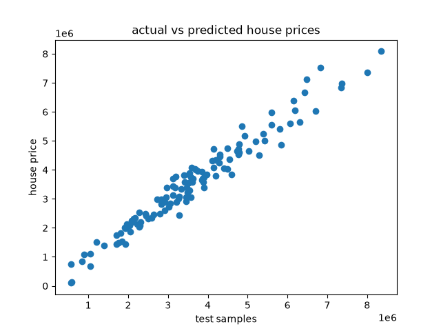

# Property Price Prediction using Linear Regression

Predicts property prices (INR) from size, rooms, age, parking, floor and locality using a Linear Regression model. The model explains about **96%** of the variance in prices on unseen data.

## Dataset
- 600 properties (480 train / 120 test)
- Features: `sqft`, `bedrooms`, `bathrooms`, `age_years`, `parking`, `floor`, `area` (locality)
- Target: `price_inr`
- Localities: Aundh, Baner, Hadapsar, Kothrud, Viman Nagar, Wakad
- Source: [add dataset source / link here]

## Workflow
1. **Cleaning:** dropped the `id` column, checked for nulls and data types
2. **Encoding:** one-hot encoded the categorical `area` column with `pd.get_dummies`
3. **Split:** 80/20 train-test split (`random_state=42`)
4. **Scaling:** `StandardScaler`, fit on the training set only to avoid data leakage
5. **Model:** `LinearRegression` from scikit-learn
6. **Evaluation:** MAE, MSE and R², compared against the average price

## Results

| Metric | Value |
|--------|-------|
| MAE | ₹2,73,279.74 |
| MSE | 11,51,51,000,098.57 |
| RMSE | ≈ ₹3,39,340 |
| R² | 0.96 |
| Average price | ₹36,67,348.33 |

On average, predictions are off by about **₹2.7 lakh, roughly 7.5% of the mean price**.

## Key observations
- **Size is the strongest driver.** `sqft` has by far the largest coefficient on the scaled features.
- **Age lowers price.** `age_years` has a clearly negative coefficient, so older properties are cheaper.
- **Locality matters.** Baner carries a premium, while Hadapsar and Wakad sit below the baseline.
- **Weak spot:** the model does poorly on very low-priced properties (for example, an actual ₹5.83 lakh predicted as ₹1.32 lakh). Linear models struggle at the extremes of the price range.

## Possible improvements
- Try Ridge/Lasso, Random Forest or Gradient Boosting and compare against this baseline
- Use `drop_first=True` in `get_dummies` to avoid redundant dummy columns
- Add cross-validation for a more reliable performance estimate
- Plot residuals to check for patterns the linear model misses

## Visualization


## Tech stack
Python, pandas, scikit-learn, matplotlib

## How to run
```bash
git clone https://github.com/deepikabharti1/house-price-prediction.git
cd house-price-prediction
pip install -r requirements.txt
python house_price_pred.py
```

## Author
Deepika Bharti · [GitHub](https://github.com/deepikabharti1)
